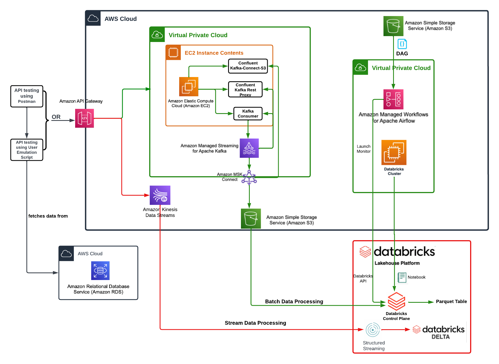
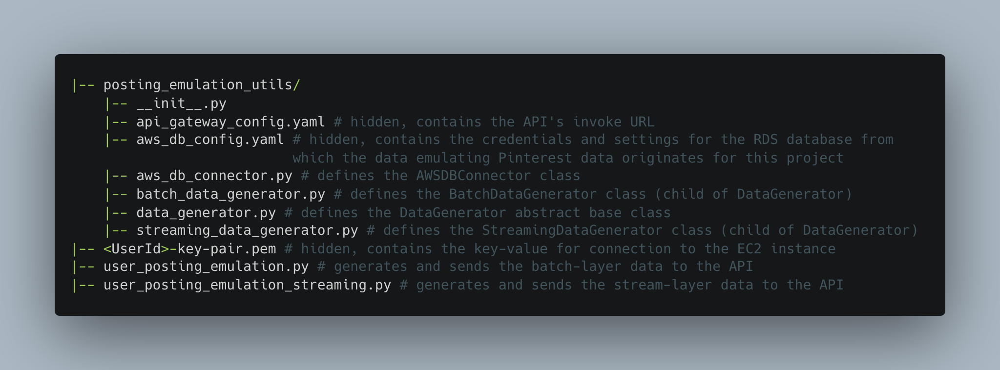
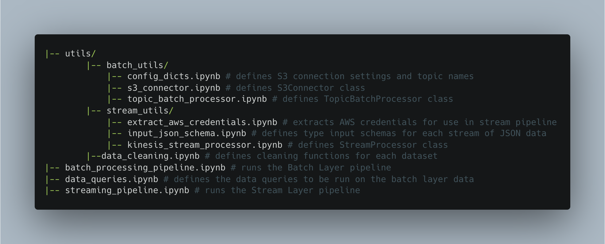

# Pinterest Data Pipeline

*Data Engineering Project - [AiCore](https://www.theaicore.com/) (December 2023)*


           

                    


**The brief for this project was to build an end-to-end AWS-hosted data pipeline inspired by Pinterest’s experiment processing pipeline.**

**The pipeline is built to be able to crunch billions of datapoints per day in order to run thousands of experiments daily.**

**Apart from providing me with experience in setting up and implementing complex Cloud infrastructure, working with stream- and batch- processing methods in Databricks and job-orchestration using Airflow, this project helped me to get familiar with Lambda architecture as a powerful framework for the efficient processing of big data.**

**By leveraging the benefits of batch-processing for resource-intensive queries on historical data and the speed of stream-processing for low-intensity, low-latency production of real-time views, this hybrid deployment model offers an agile, efficient and high-fault-tolerant data-processing stack that enables consistent and targeted evaluation of Pinterest's product on an ongoing basis.**

## Table of Contents
* [Project Overview](#project-overview)
* [Installation](#installation)
* [File Structure](#file-structure)
    * [Local Machine](#local-machine)
    * [EC2 Client Machine](#ec2-client-machine)
    * [Databricks Workspace](#databricks-workspace)
    * [AWS MWAA Environment](#aws-mwaa-environment)
* [Usage](#usage)
* [Next Steps](#next-steps)
* [Licence](#licence)

## [Project Overview](#project-overview)

To mimic the creation of real-time user data from Pinterest, I wrote scripts that extract rows of data at random from three tables within an AWS RDS database. These randomly extracted datapoints are sent as JSON objects via an API (which I developed on AWS API Gateway) into their respective processing layers within the pipeline.

The pipeline is developed using a Lambda architecture.

For the **Batch Layer**:
- The data is ingested, in relation to three Kafka topics, via a REST proxy-integrated API connecting the Kafka Client launched on an EC2 instance with an MSK cluster on AWS.
- I created a sink connector within MSK Connect that directs the incoming data to its target topic folder within an S3 bucket.
- The data is processed within Databricks using Apache Spark: within Databricks, the data from each topic is read into Spark DataFrames and cleaned before being queried using SQL.
- Extracting comprehensive insights from the so-called historical data of the batch layer, the SQL queries generate daily, precomputed batch views written to Parquet tables within Databricks, ready for ingestion to a **Serving Layer**.
- The job is orchestrated from the Apache Airflow UI on an AWS MWAA environment using a DAG which currently schedules the batch layer pipeline to be run once daily at midnight.

For the **Speed Layer** (or **Stream Layer**):
- The data is ingested, as three streams, using AWS API Gateway into AWS Kinesis.
- The data is read in near-real-time from Kinesis into DataFrames using Spark Structured Streaming within Databricks.
- After cleaning, the data is written into Databricks Delta Tables for long-term storage.

The same **data cleaning transformations** are performed on the corresponding datasets across the two layers. These include:
- Reordering, renaming, combining and/or dropping columns for better data comprehension
- Type-casting columns where necessary
- Data normalisation, including replacing missing or unmeaningful values with `None`



## [Installation](#installation)

This project relies on access to an RDS database on AWS storing data across three tables which resemble the data generated each time a user posts something on Pinterest. The scripts I wrote extract rows of data at random from this database to emulate the creation of real-time user data, each of which sends this data to an API which directs this data into the data pipelines.

The data emulation and ingestion into the Cloud requires the following packages installed on the user's local machine or IDE:

- Python 3+
- PyMySQL (if connecting to a MySQL database, as we are here)
- SQLAlchemy
- PyYAML

In terms of AWS cloud infrastucture, the pipeline is made up of the following components:
- An Apache Kafka MSK cluster
- An EC2 instance integrated with the MSK cluster (launched before configuring the API)
- An S3 bucket to store the ingestion of batch layer data
- A VPC gateway endpoint to S3
- An API configured on API Gateway with:
    - a proxy resource integrated with the EC2 instance for the ingestion of data via the Kafka client
    - Kinesis-integrated resources with HTTP methods enabling the ingestion of data to Kinesis streams with header settings configured
- 3x streams created in AWS Kinesis (1x for each dataset)
- An MWAA environment and an S3 bucket within it to hold the DAGs for the batch layer job orchestration, with API-token access to allow Databricks to connect to the AWS account.

In order to follow the principle of least privilege, it would be recommended to:
- Create an IAM user with full S3 access permissions through which to authorize connection between Databricks and AWS S3
- Create and assume an IAM role allowing authentication to the MSK cluster through the EC2 client machine
- Create and assume an IAM role granting the necessary permissions to invoke Kinesis actions - and assign this as the execution role at the corresponding API integration points

The pipeline administrator will also need a Databricks account.

Before being able to launch the pipeline, the user will need to configure the Kafka client by launching their EC2 instance, and connecting to their EC2 instance through the command line. (In my case, this was done using the SSH Client protocol, which required a key-value pair to be saved on my local machine inside a `.pem` file.)

Inside the EC2 client the user will need to:
- Download Java
- Download Kafka (the same version as is run on the MSK cluster)
- Install the IAM MSK Authentication package (available on GitHub) within the Kafka `libs` directory
- Export a path to the `IAM MSK Authentication` package to a `CLASSPATH` variable inside their EC2 instance's `/home/ec2-user/.bashrc` file (to enable the Kafka client to locate and utilise the necessary Amazon MSK IAM libraries when executing commands)
- Configure the Kafka client to use `AWS IAM authentication` to the cluster by modifying the `client.properties` file inside the Kafka `bin` directory, configuring it to communicate with the API REST proxy resource created previously
- Create three Kafka topics on the EC2 Client, e.g.:
    - `<UserId>.pin` for the Pinterest posts data
    - `<UserId>.geo` for the post geolocation data
    - `<UserId>.user` for the post user data
- Download an S3 connector that can export data from Kafka topics to S3 (this pipeline used Confluent.io's Amazon S3 Connector)
- Copy the connector over to the dedicated (batch-layer) S3 bucket on AWS

Back on the AWS console, the user will need to:
- Create a custom plug-in on MSK Connect using the S3 connector copied over to the S3 bucket from the EC2 Client
- Create an S3 sink connector which is configured to ensure that the data going through all the three previously created Kafka topics will get sent to the correct S3 bucket (the connector in this pipeline was configured to be provisioned with a single MCU count per worker and single worker, and was provided access permissions to the IAM role mentioned previously)
- Upload the DAG script to the S3 bucket in the MWAA environment
- Deploy the API and copy the invoke URL over to the `api_gateway_config.yaml` on their local machine (see file structure below)

### Other files and repositories:

- The Databricks workspace will need to contain the files and folders represented in the `databricks-workspace` directory of this GitHub repository.
- A `.csv` file containing the programmtic access key for authentication to AWS will need to be saved in the following Databricks location: `/FileStore/tables/authentication_credentials.csv`.
- Other than the files represented in this repository, the following files on my local machine are hidden from the GitHub repository:
    - `api_gateway_config.yaml` to store the invoke url of the API created on API Gateway
    - `aws_db_config.yaml` to store the database connection details for the AWS-stored data from which we are extracting the simulated data points
    - `<UserId>-key-pair.pem` to store the value for the key-pair used for SSH client authenticaion to your EC2 instance
    - *See the file structure diagram below, to see where these are saved.*
- The DAG file stored in the `dags` directory of this repository needs to be uploaded to the `dags` folder within the dedicated bucket in the MWAA environment. (The DAG configuration settings in the script will need to be adjusted as per the pipeline's requirements.)

### Launching the pipeline:
- Double check consistency in the Kafka topic naming across the Kafka Client on EC2, the local machine emulation script and the Databricks workspace config dictionary.
- Double check consistency in the Kinesis stream naming across AWS Kinesis, the local machine emulation script and the Databricks workspace stream layer pipeline notebook.
- Make sure the EC2 instance is in launched-mode, and its current state publicDNS has been used in the proxy integration API resource on API Gateway.
- Make sure the API on API Gateway is deployed and the correct invoke URL has been passed into the `api_gateway_config.yaml` file on your local machine
- From your EC2 instance, start the REST proxy by first navigating to `confluent-7.2.0/bin` then running:
```
./kafka-rest-start /home/ec2-user/confluent-7.2.0/etc/kafka-rest/kafka-rest.properties
```
- In one terminal shell, to start generating and sending data to the Kafka topics, to be fed into the batch layer, run:
```
python -m user_posting_emulation
```
- To send data to the Kinesis streams, run:
```
python -m user_posting_emulation_streaming
```
- Monitor the progress of the batch layer pipeline through the Apache Airflow UI on AWS MWAA.
- Within Databricks, manually trigger the stream-processing layer by running the code blocks sequentially in `stream_pipeline.ipynb`

## [File Structure](#file-structure)

The files available in this repository represent:
- those that make up the data generation/posting emulation from my local machine
- the Databricks Workspace
- the `dags/` repository in the S3 bucket within the MWAA environment on AWS

### [Local Machine](#local-machine)

> Note the hidden files, also listed above in [Installation](#installation)



### [Databricks Workspace](#databricks-workspace)


- `batch_processing_pipeline.ipynb` conducts the processing of the batch layer data read from S3:
    - If not already mounted, the script mounts the S3 bucket to Databricks
    - It reads the JSON objects in S3 into a Spark dataframe for each topic
    - It cleans the data in the Spark dataframe (replacing erroneous or missing values with `None`s, data normalisation, type casting, dropping or creating new columns)
    - It then conducts a series of SQL queries on the cleaned datasets, which are stored to dataframes
    - In the next step for this project, these batch views would be output to a serving layer
- `utils`


```

# S3
'-- user-<UserId>-bucket/


|-- dags/
    |-- 0a3db223d459_dag.py


```
S3 after downloading Confluent.io Amazon S3 Connector and copying it to s3 bucket via the EC2 instance
```
|-- user-<UserId>-bucket/
    |-- kafka-connect-s3/
        '-- confluentinc-kafka-connect-s3-10.0.3.zip
    '-- topics/
```
S3 after data REST proxy is activated and data is sent
```
|-- user-<UserId>-bucket/
    |-- kafka-connect-s3/
        '-- confluentinc-kafka-connect-s3-10.0.3.zip
    '-- topics/
          |-- <UserId>.geo/
              '-- partition=0/
                  |-- JSON OBJECTS
                  '-- ...
          |-- <UserId>.pin/
              '-- partition=0/
                  |-- JSON OBJECTS
                  '-- ...
          '-- <UserId>.user/
              '-- partition=0/
                  |-- JSON OBJECTS
                  '-- ...
```

## Usage

To emulate the data generated by Pinterest, this project relies on access to an RDS database on AWS storing data across three tables which resemble the data generated each time a user posts something on Pinterest. The three datasets represent:
- Data relating to the Pinterest post itself (aka the `pin` table)
- Data about the user that interacted with the post (aka the `user` table)
- Data about the geolocation of the user-post interaction (aka the `geo` table)


## [Next Steps](#next-steps)

The next stage of development for this pipeline would be to develop the **Server Layer** of the architecture, where the outputs of the batch and stream layers could be merged to allow for both historical and real-time data analysis. (To provide a faithful implementation of this, I would need to first amend the posting emulation scripts to generate the same datapoints concurrently for input to the pipeline.)

## [Licence](#licence)

This project was supervised and is owned by [AiCore](https://www.theaicore.com/), a specialist AI & Data career accelerator whose focus is on building experience through real-world, industry-grade projects and applications.