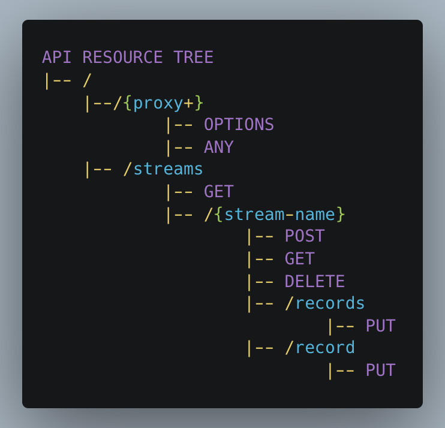
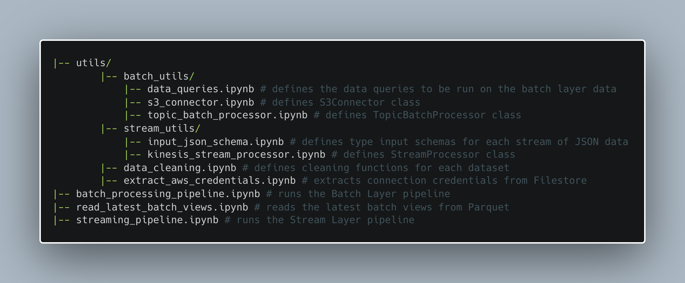
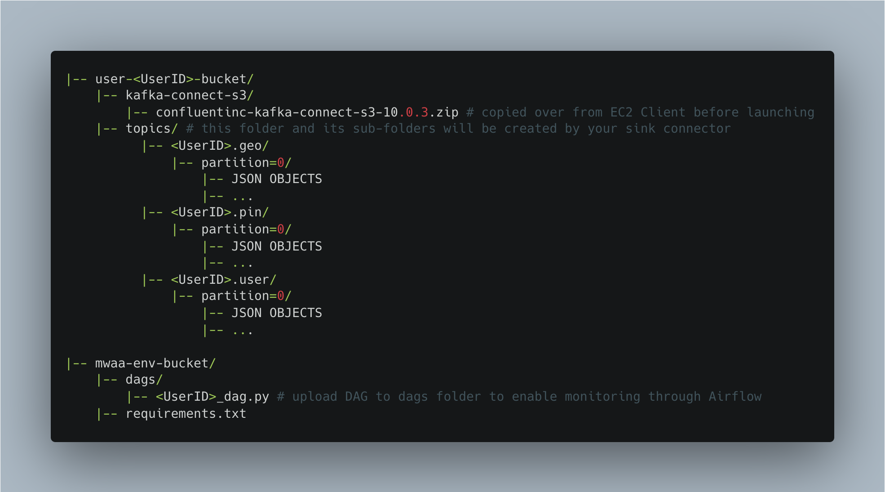

# Pinterest Data Pipeline

*Data Engineering Project - [AiCore](https://www.theaicore.com/) (December 2023)*


                

                      


**The brief for this project was to build an end-to-end AWS-hosted data pipeline inspired by Pinterest’s experiment processing pipeline.**

**The pipeline is built to be able to crunch billions of datapoints per day in order to run thousands of experiments daily.**

**As well as consolidating my experience in setting up and implementing complex Cloud infrastructure, working with stream- and batch- processing methods in Databricks and job-orchestration using Airflow, this project helped me to get familiar with Lambda architecture as a powerful framework for the efficient processing of big data.**

**By leveraging the benefits of batch-processing for resource-intensive queries on historical data and the speed of stream-processing for low-intensity, low-latency production of real-time views, this hybrid deployment model offers an agile, efficient and high-fault-tolerant data-processing stack for the handling and storing of high-volume user-generated data.**

**The result is a robust pipeline that can facilitate consistent and targeted evaluation of Pinterest's product on an ongoing basis.**

## Table of Contents
* [Project Overview](#project-overview)
    * [Pipeline Infrastructure](#infrastucture-diagram)
* [Installation](#installation)
* [File Structure](#file-structure)
    * [Local Machine](#local-machine)
    * [EC2 Client Machine](#ec2-client-machine)
    * [Databricks Workspace](#databricks-workspace)
    * [AWS S3 Buckets](#s3-buckets)
* [Usage](#usage)
* [Licence](#licence)

## [Project Overview](#project-overview)

To mimic the creation of real-time user data from Pinterest, I wrote a Python program that extracts a set of data at random, every 0-2 seconds, from three tables in an AWS RDS database storing historic Pinterest data. The three datasets are linked by index number: each set of three rows with the same index number represent three collections of data relating to one Pinterest user event:
- Data relating to the Pinterest post itself
- Data about the user that interacted with the post
- Data about the geolocation of the user-post interaction

### The datasets in their original form in the AWS database:


The data is sent into two distinct layers of the experiment pipeline (one for batch processing and one for stream processing) via the two resources of an API I developed on AWS API Gateway.

Although the tasks are largely I/O-bound for this part of the pipeline, I opted for a multiprocessing approach to run the program extracting and sending datapoints relating to each of the three datasets in parallel. This probably wouldn't translate to the real-world use-case but it was in this case beneficial, since I could take advantage of being able to pass a shared random number generator to each of the processes - ensuring the three rows of data being extracted for each dataset at each time were related to the same event and produced on the same timeline.

Since for each unique data-sending event two API requests had to be made, I workshopped and researched a few different implementations of multithreading here with a view to optimising throughput and overhead usage. In the end, I implemented this using a ThreadPoolExecutor context that is kept open for the duration of the data sending process.

The pipeline is developed using a Lambda architecture.


For the **Batch Layer**:
- The data is ingested, in relation to three Kafka topics, via a REST proxy-integrated API connecting the Kafka Client launched on an EC2 instance with an MSK cluster on AWS.
- I created a sink connector within MSK Connect that directs the incoming data to its target topic folder within an S3 bucket.
- The data is processed within Databricks using Apache Spark: the data from each topic is read into Spark DataFrames and cleaned before being queried using SQL.
- I wrote SQL queries to extract a series of comprehensive insights from the so-called historical data of the batch layer: these queries generate daily, precomputed batch views that are written to Parquet files within Databricks, ready for ingestion to a **Serving Layer**.
- The job is orchestrated from the Apache Airflow UI on an AWS MWAA environment using a DAG which currently schedules the batch layer pipeline to be run once daily at midnight.

For the **Speed Layer** (or **Stream Layer**):
- The data is ingested, as three streams, using AWS API Gateway into AWS Kinesis.
- The data is read in near-real-time from Kinesis into DataFrames using Spark Structured Streaming within Databricks.
- After cleaning, the data is written into Databricks Delta Tables for long-term storage.

(The next stage of development for this pipeline would be to develop the **Server Layer** of the architecture, where the outputs of the batch and stream layers could be merged to allow for both historical and real-time data analysis.)

The same **data cleaning transformations** are performed on the corresponding datasets in the two layers. These include:
- Reordering, renaming, combining and/or dropping columns for better data comprehension
- Type-casting columns where necessary
- Data normalisation, including replacing missing or unmeaningful values with `None`

### [Pipeline Infrastructure](#infrastructure-diagram)


## [Installation](#installation)

This project relies on access to an RDS database on AWS storing data across three tables which resemble the data generated each time a user posts something on Pinterest. The script I wrote extracts rows of data at random from this database to emulate the creation of real-time user data, and submits this data to the two processing layers of the pipeline via an API.

The data emulation and ingestion into the AWS-hosted pipeline requires the following packages installed on the user's local machine or environment:

- Python 3+
- PyMySQL (if connecting to a MySQL database, as we are here)
- SQLAlchemy
- PyYAML

In terms of AWS Cloud infrastucture, the pipeline is made up of the following components:
- An Apache Kafka MSK cluster
- An EC2 instance integrated with the MSK cluster (launched before configuring the API)
- An S3 bucket to store the ingestion of batch layer data
- A VPC gateway endpoint to S3
- An API configured on API Gateway with:
    - a proxy resource integrated with the EC2 instance for the ingestion of data via the Kafka client
    - Kinesis-integrated resources with HTTP methods enabling the ingestion of data to Kinesis streams with header settings configured



- 3x data streams created in AWS Kinesis (1x for each dataset), e.g. to follow the naming conventions used in this project:
    - `streaming-<UserID>-pin`
    - `streaming-<UserID>-user`
    - `streaming-<UserID>-geo`
- An MWAA environment and an S3 bucket designated to it to hold the DAGs for the batch layer job orchestration
- To create an MWAA-Databricks connection, the user will need to create an API-token access in Databricks, the MWAA-environment-designated S3 bucket will need a `requirements.txt` file uploaded to it in order to have the required Python dependencies uploaded, including `apache-airflow[databricks]`, and the path to the `requirements.txt` file will need to be specified on the MWAA console (follow the instructions provided [here](https://docs.aws.amazon.com/mwaa/latest/userguide/working-dags-dependencies.html))
- After the `requirements.txt` file is uploaded, the MWAA-Databricks connection can be activated from the Apache Airflow UI with the following settings:


In order to follow principles of least privilege, it would be recommended to:
- Create an IAM user with full S3 access permissions through which to authorize connection between Databricks and AWS S3
- Create and assume an IAM role allowing authentication to the MSK cluster through the EC2 client machine
- Create and assume an IAM role granting the necessary permissions to invoke Kinesis actions - and assign this as the execution role at the corresponding API integration points

The pipeline administrator will also need a Databricks account.

Before being able to launch the pipeline, the user will need to configure the Kafka client by launching their EC2 instance, and connecting to their EC2 instance through the command line. (In my case, this was done using the SSH Client protocol, which required a key-value pair to be saved on my local machine inside a `.pem` file.)

Inside the EC2 client the user will need to:
- Download Java and Kafka (the same version as is run on the MSK cluster)
- Install the IAM MSK Authentication package (available on GitHub) within the Kafka `libs` directory
- Export a path to the `IAM MSK Authentication` package to a `CLASSPATH` variable inside their EC2 instance's `/home/ec2-user/.bashrc` file (to enable the Kafka client to locate and utilise the necessary Amazon MSK IAM libraries when executing commands)
- Configure the Kafka client to use AWS IAM authentication to the cluster by modifying the `client.properties` file inside the Kafka `bin` directory, configuring it to communicate with the API REST proxy resource created previously
- Create three Kafka topics on the EC2 Client, e.g.:
    - `<UserId>.pin` for the Pinterest posts data
    - `<UserId>.geo` for the post geolocation data
    - `<UserId>.user` for the post user data
- Download an S3 connector that can export data from Kafka topics to S3 (this pipeline used Confluent.io's Amazon S3 Connector)
- Configure the settings in the `kafka-rest.properties` file inside the newly created connector directory, e.g. `confluent-7.2.0/etc/kafka-rest` to configure the REST proxy to communicate with the desired MSK cluster and to perform IAM authentication
- Copy the connector over to the dedicated (batch-layer) S3 bucket on AWS

Back on the AWS console, the user will need to:
- Create a custom plug-in on MSK Connect using the S3 connector copied over to the S3 bucket from the EC2 Client
- Create an S3 sink connector which is configured to ensure that the data going through all the three previously created Kafka topics will get sent to the correct S3 bucket (the connector in this pipeline was configured to be provisioned with a single MCU count per worker and single worker, and was provided access permissions to the IAM role mentioned previously)
- After making the necessary amendments, upload the DAG script from this GitHub repo to the S3 bucket in the MWAA environment
- Deploy the API and copy the invoke URL over to the `api_gateway_config.yaml` on their local machine (see file structure below)

### Other files and repositories:

- The Databricks workspace will need to contain the files and folders represented in the `databricks-workspace` directory of this GitHub repository.
- A `.csv` file containing the programmtic access key for authentication to AWS will need to be saved in the following Databricks location: `/FileStore/tables/authentication_credentials.csv`.
- Other than the files represented in this repository, the following files on my local machine are hidden from the GitHub repository:
    - `api_gateway_config.yaml` to store the invoke url of the API created on API Gateway
    - `aws_db_config.yaml` to store the database connection details for the AWS-stored data from which we are extracting the simulated data points
    - `<UserId>-key-pair.pem` to store the value for the key-pair used for SSH client authenticaion to your EC2 instance
    - *See file structure below, to see where these are saved.*
- The DAG script stored in the `dags` directory of this repository needs to be uploaded to the `dags` folder within the dedicated bucket in the MWAA environment. (The DAG configuration settings in the script will need to be adjusted as per the pipeline's requirements.)

Follow the instructions in [Usage](#usage) below for how to actually launch the pipeline from here.

## [File Structure](#file-structure)

The files available in this repository represent those that make up the posting emulation program from my **local machine**, the notebooks that make up the processing layers of the pipeline in **the Databricks Workspace** online, and the `dags/` repository in **the S3 bucket designated to the MWAA environment on AWS** which monitors and orchestrates the processing of the batch layer data.

Also represented in the sections below are the required file structures of the S3 buckets on the AWS Console and of the EC2 Client Machine.

### 1. [Local Machine File Structure](#local-machine)

The following files make up the posting emulation program run from my local machine - note the files hidden from this GitHub repository:


### 2. [EC2 Client Machine File Structure](#ec2-client-machine)

Refer to the file structure below when following the installation instructions within the EC2 Client Machine:


### 3. [Databricks Workspace File Structure](#databricks-workspace)

Set up your Databricks Workspace exactly as shown (not forgetting the `authentication-credentials.csv` which additionally needs to be stored in the Filestore):



### 4. [AWS S3 Buckets File Structure](#s3-buckets)

Refer to the file structure below when following the installation instructions relating to AWS S3 and AWS MWAA:



## [Usage](#usage)

### Launching the pipeline:
- Before launching the pipeline:
    - check consistency in the Kafka topic naming across the Kafka Client on EC2, the local machine emulation script and the Databricks workspace config dictionary;
    - check consistency in the Kinesis stream naming across AWS Kinesis, the local machine emulation script and the Databricks workspace stream layer pipeline notebook;
    - make sure the EC2 instance is in launched-mode, and its current state publicDNS has been used in the proxy integration API resource on API Gateway;
    - make sure the API on API Gateway is deployed and the correct invoke URL has been passed into the `api_gateway_config.yaml` file on your local machine.
- Connect to the EC2 instance from the terminal using the SSH Client protocol, e.g.:
```
$ ssh -i <FilePathToKey-ValuePEM> ec2-user@<PublicIPv4DNS>
```
- Inside the EC2 instance, navigate to the REST proxy directory bin, e.g.:
```
$ cd confluent-7.2.0/bin
```
- Start the REST proxy:
```
$ ./kafka-rest-start /home/ec2-user/confluent-7.2.0/etc/kafka-rest/kafka-rest.properties
```
- When the Kafka REST proxy is fully started up (it will indicate that the server is listening), from a terminal window in the repository on your local machine, start generating and sending data into the pipeline by running:
```
$ python user_posting_emulation.py
```
- Press ENTER at any time in the terminal to stop the data posting and bring the user_posting_emulation script to a close:


- Within Databricks, manually trigger the stream-processing layer by running the `stream_processing_pipeline.ipynb` notebook
- You can also manually trigger the batch layer processing for testing by running the `batch_processing_pipeline.ipynb` notebook (or else wait for the run scheduled by the DAG on AWS MWAA)

### Daily batch views
The pipeline is built to run a set of SQL queries on each batch of cleaned data, the outputs of which are stored in Parquet files within Databricks. To read the latest batch layer processing outputs from Parquet, run the `read_latest_batch_views.ipynb` notebook within the Databricks workspace.

As per the job orchestration instructions defined in the DAG, the batch views are currently produced on the master dataset daily. So, each day, the following views on the dataset are computed:

1. The most popular post category per country, e.g.:

|country                                            |category      |category_count|
|---------------------------------------------------|--------------|--------------|
|Afghanistan                                        |education     |17            |
|Albania                                            |diy-and-crafts|320           |
|Algeria                                            |quotes        |31            |
|American Samoa                                     |education     |16            |
|Andorra                                            |tattoos       |16            |
|Angola                                             |diy-and-crafts|95            |
|Anguilla                                           |home-decor    |158           |
|Antarctica (the territory South of 60 deg S)       |christmas     |50            |
|Antigua and Barbuda                                |art           |17            |
|Argentina                                          |tattoos       |21            |
|Armenia                                            |diy-and-crafts|187           |
|Aruba                                              |tattoos       |578           |
|Australia                                          |mens-fashion  |58            |
|Austria                                            |travel        |66            |
|Azerbaijan                                         |event-planning|359           |
|Bahamas                                            |art           |9             |
|Bahrain                                            |travel        |6             |
|Bangladesh                                         |art           |67            |
|Barbados                                           |travel        |65            |
|Belarus                                            |travel        |2             |
|Belgium                                            |christmas     |2             |
|Belize                                             |diy-and-crafts|4             |
|Benin                                              |travel        |5             |
|Bermuda                                            |christmas     |12            |
|Bhutan                                             |diy-and-crafts|6             |
|Bolivia                                            |home-decor    |5             |
|Bosnia and Herzegovina                             |christmas     |2             |
|Bosnia and Herzegovina                             |education     |2             |
|Botswana                                           |tattoos       |26            |
|Bouvet Island (Bouvetoya)                          |tattoos       |5             |
|Brazil                                             |christmas     |4             |
|British Indian Ocean Territory (Chagos Archipelago)|mens-fashion  |1             |
|British Indian Ocean Territory (Chagos Archipelago)|finance       |1             |
|British Indian Ocean Territory (Chagos Archipelago)|tattoos       |1             |
|British Virgin Islands                             |christmas     |11            |
|...|...|...|

2. The most popular post category per year, e.g:

|post_year|category      |category_count|
|---------|--------------|--------------|
|2018     |beauty        |551           |
|2019     |diy-and-crafts|445           |
|2020     |tattoos       |602           |
|2021     |finance       |458           |
|2022     |vehicles      |342           |

3. The users with the most followers per country, e.g.:

|             country|         poster_name|follower_count|
| --- | --- | --- |
|         Afghanistan|                9GAG|       3000000|
|             Albania|   The Minds Journal|       5000000|
|             Algeria|           YourTango|        942000|
|      American Samoa|         Mamas Uncut|       8000000|
|             Andorra|Teachers Pay Teac...|       1000000|
|              Angola|           Tastemade|       8000000|
|            Anguilla|Kristen | Lifesty...|         92000|
|Antarctica (the t...|          Refinery29|       1000000|
| Antigua and Barbuda|Country Living Ma...|       1000000|
|           Argentina|         Cheezburger|       2000000|
|             Armenia|Michelle {CraftyM...|        892000|
|               Aruba|         GQ Magazine|        874000|
|           Australia|        Mujer de 10 |       2000000|
|             Austria|               Diply|        251000|
|          Azerbaijan|     Style Me Pretty|       6000000|
|             Bahamas|  Handmade Charlotte|        948000|
|             Bahrain|Alea Milham | Pre...|        332000|
|          Bangladesh|Better Homes and ...|       4000000|
|            Barbados|The Creativity Ex...|        410000|
|             Belarus| Something Turquoise|        312000|
|...|...|...|

4. The country of the user with the most followers, e.g.:

|       country|follower_count|
| --- | --- |
|American Samoa|       8000000|
|        Angola|       8000000|

5. The most popular post category per age group, e.g.:

|age_group|category    |category_count|
|---------|------------|--------------|
|18-24    |mens-fashion|927           |
|25-35    |beauty      |584           |
|36-50    |home-decor  |349           |
|>50      |beauty      |44            |

6. The median follower count per age group, e.g.:

|age_group|median_follower_count|
|---------|---------------------|
|18-24    |92000                |
|25-35    |43000                |
|36-50    |9000                 |
|>50      |5000                 |

7. The total new users per year, e.g.:

|post_year|number_users_joined|
| --- | --- |
|     2015|                451|
|     2016|                505|
|     2017|                179|

8. The median follower count by user joining year, e.g.:

|joining_year|median_follower_count|
|------------|---------------------|
|2015        |92000                |
|2016        |21000                |
|2017        |7000                 |

9. The median follower count per user joining year and age group, e.g:

|age_group|joining_year|median_follower_count|
|---------|------------|---------------------|
|18-24    |2015        |211000               |
|25-35    |2015        |51000                |
|36-50    |2015        |25000                |
|>50      |2015        |196                  |
|18-24    |2016        |4000                 |
|25-35    |2016        |43000                |
|36-50    |2016        |9000                 |
|>50      |2016        |316                  |
|18-24    |2017        |940                  |
|25-35    |2017        |79000                |
|36-50    |2017        |6000                 |
|>50      |2017        |5000                 |

### Batch Layer job orchestration
The batch layer pipeline can be monitored through the Apache Airflow UI, which is accessed via its environment on the AWS MWAA console.

### Stream Layer data
The data passing through the Stream Layer will be appended after cleaning to the desifnated Delta Tables. In the case of this pipeline, the Delta tables are named according to the following convention:
- `<UserID>_geo_table`
- `<UserID>_pin_table`
- `<UserID>_user_table`

Navigate to the `hive_metastore` in the Databricks Catalog to view the schema of the data going into the Delta tables and samples of the data being appended.

## [Licence](#licence)

This project was supervised and is owned by [AiCore](https://www.theaicore.com/), a specialist AI & Data career accelerator whose focus is on building experience through real-world, industry-grade projects and applications.